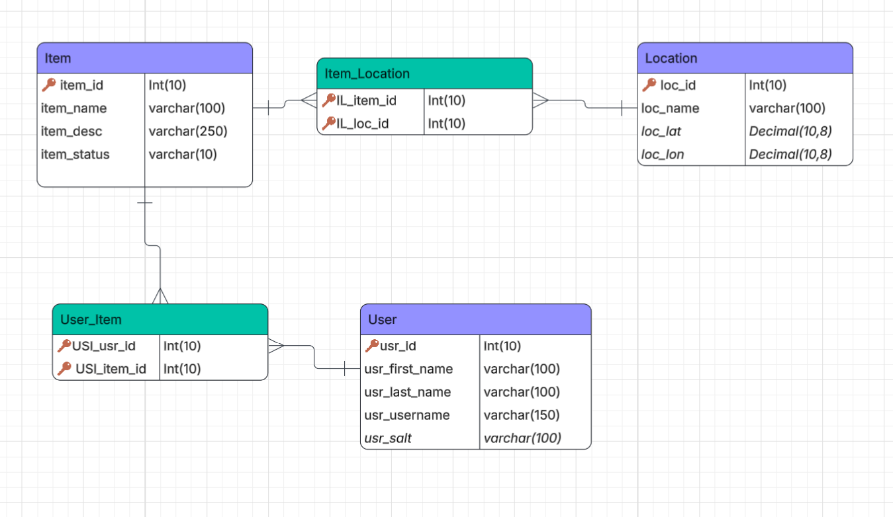

# Team Project: Milestone 2

## NCSU PackFinder

## Progress Report

### Completed Features

* **User Authentication & Authorization:** Implemented secure user registration and login utilizing `bcryptjs` for password hashing and JSON Web Tokens (JWT) for stateless session management.
* **Protected Routes & Access Control:** Backend API routes (like creating posts, replying, and viewing profiles) now require a valid JWT `Bearer` token.
* **Dynamic Routing & Redirection:** The root URL (`/`) now automatically redirects users to the Home page if they are logged in, or the Login page if their token is missing or expired.
* **Interactive Campus Map:** Replaced the map placeholder with a fully interactive `Leaflet.js` map that dynamically renders custom markers for official lost-and-found desks and user-submitted lost items based on geolocation coordinates.
* **Home Page Sneakpeeks:** Implemented data fetching on the Home page to display "sneakpeek" widgets showing the 3 most recent forum posts and official desk locations.
* **Profile Management:** Users can now securely update their username, reset their password, and view a filtered list of their personal posts. 
* **Forum Replies:** Added the ability for authenticated users to reply to existing lost and found posts in the forum feed.
* **Relational Database Migration:** Completely transitioned from in-memory JSON data to a persistent MariaDB relational database using raw SQL queries and a connection pool.
* **Image Uploading:** Integrated `multer` middleware to handle `multipart/form-data`, allowing users to upload images when creating a post, which are statically served and dynamically rendered in the forum feed.
* **Location Pinning:** Integrated Leaflet into the post creation form, allowing users to drop a pin on an interactive map to capture exact latitude and longitude coordinates for their lost or found item.
* **Inline Status Updates:** Users can now seamlessly update the status of an item(Lost, Found, Turned In) directly from the forum feed via an interactive dropdown.

### Pending Features

* **General Map Improvements:** Making some finishing touches to the map, such as filtering by color/type/time period, finalizing what info is displayed for a given item when viewing the map, etc.
* **Item Details View:** Creating a dedicated standalone page for viewing a single item in high detail.

### Page Implementation Progress

Page    | Status | Wireframe
------- | ------ | ---------
Login/Register | ✅ | 
Home    | ✅     | 
Interactive Map | 80% | [wireframe](https://github.com/ncstate-csc-coursework/csc342-2026Spring-TeamG/blob/main/wireframes/mobile_map.png)
Lost & Found Forum | ✅ | 
User Profile | ✅ | 
Create New Post | ✅ | 
Item Details & Status | 90% | [wireframe](https://github.com/ncstate-csc-coursework/csc342-2026Spring-TeamG/blob/main/wireframes/desktop_all.webp)

## API Documentation

Method | Route                 | Description
------ | --------------------- | ---------
`POST` | `/users/register`     | Receives username, email, and password, hashes the password with bcrypt, and creates a new user in the database.
`POST` | `/users/login`        | Authenticates a user's credentials against the database and returns a signed JWT token.
`POST` | `/users/logout`       | Terminates the user's session from the frontend perspective.
`GET`  | `/users/profile`      | **(Protected)** Retrieves the profile information for the currently authenticated user based on their JWT.
`PUT`  | `/users/profile/username` | **(Protected)** Updates the current user's username in the database and issues a fresh JWT.
`PUT`  | `/users/profile/password` | **(Protected)** Updates and hashes a new password for the current user.
`GET`  | `/items`              | Retrieves an array of lost and found posts from the database using JOINs. Accepts a `?user=` query parameter to filter posts by a specific username.
`POST` | `/items`              | **(Protected)** Creates a new post. Accepts `multipart/form-data` including an image file. Uses SQL transactions to update Item, Location, and User_Items tables simultaneously.
`GET`  | `/items/:itemId`      | Retrieves the specific details of a single item using its ID.
`PUT`  | `/items/:itemId/status` | Updates the status of an existing item in the database.
`POST` | `/items/:itemId/replies`| **(Protected)** Adds a new reply to a specific item post in the database.
`GET`  | `/locations/desks`    | Retrieves coordinates for official NCSU lost-and-found desks from the database.

## Database ER Diagram

## Team Member Contributions

#### Cole Sprouse

* Implemented secure user authentication utilizing JSON Web Tokens (JWT) and bcryptjs password hashing.
* Built Express middleware to protect private API endpoints and extract user data securely from tokens.
* Developed frontend logic to handle token storage, dynamic root redirection, and secure logout functionality.
* Created the backend routes and frontend UI logic for updating usernames, changing passwords, and submitting forum replies.
* Updated the Login page HTML and CSS to include a seamlessly toggleable registration form alongside the login form.
* Migrated the entire backend to a MariaDB relational database, writing raw SQL queries, setting up connection pooling, and implementing transaction logic for relational inserts.
* Implemented `multer` for image uploading, utilizing `FormData` on the frontend and static file serving on the backend.
* Integrated the Leaflet map into the Create Post form for interactive coordinate capture and added inline status-updating UI to the forum feed.

#### Ramisa Tafannum

* Integrated the Leaflet.js library into the map page to replace static placeholders with a fully interactive map.
* Wrote dynamic JavaScript to fetch and plot coordinates for official L&F desks and user-submitted items onto the Leaflet map.
* Implemented the Home page "sneakpeek" functionality, fetching and displaying recent posts and map data dynamically.

#### Mallory Varinoski

* Designed the relational database schema, mapping the logical structure for Users, Items, Locations, and their many-to-many relationships without the use of an ORM.
* Authored the `01-schema.sql` initialization script to automatically generate the required database tables and columns upon container startup.
* Authored the `02-data.sql` script to populate the database with realistic mock data, including iconic NCSU campus locations, sample users, and initial lost-and-found item entries.

#### Milestone Effort Contribution

Cole Sprouse | Ramisa Tafannum | Mallory Varinoski
-------------|-----------------|------------------
34%          | 33%             | 33%
